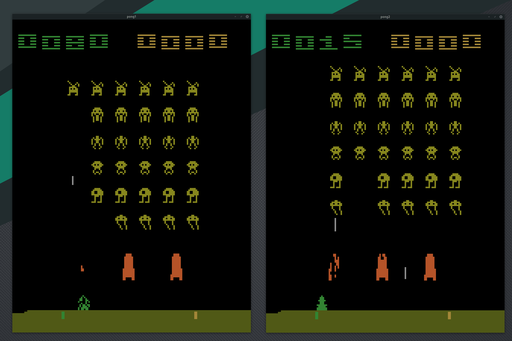

# Gym

A collection of RL envs and interfaces.
This does not internally bind to Python, which means you can run faster and parallel computations.

Example of running envs in separate threads:


Crates          | Role
----------------|----------------------------------------------------------------
`gym`           | main crate including all sub-crates
`gym-core`      | provides `GymEnv`, `ContinuousEnv`, `DiscreteEnv`, etc
`atari-env`     | atari specific interface such as `render_rgb24` or `render_ram`
`openspiel-env` |

## Example
```
cargo run --example pong
cargo run --example pongpong
cargo run --example ppo (WIP)
```

## Feature gates

Crates          | Default | Available
----------------|---------|------------
`gym`           | `atari` | `openspiel`
`gym-core`      |         |
`atari-env`     |         | `sdl`
`atari-env-sys` |         |
`openspiel-env` |         |

Example: `gym = {version = "*", features = ["atari", "openspiel", "atari_env/sdl"]} `

## ROMs
The easiest way to obtain ALE-compatible ROMs is `pip install atari-py`.
You will have ROM files in `~/.local/lib/python3.x/site-packages/atari_py/atari_roms/`.

## License
Crates          | License
----------------|--------
`gym`           | MIT
`gym-core`      | MIT
`atari-env`     | GPL v2
`atari-env-sys` | GPL v2
`openspiel-env` | ?
